# virtual-reality-handson

A handson realized with a friend during my spring semester 2023 at UTBM.

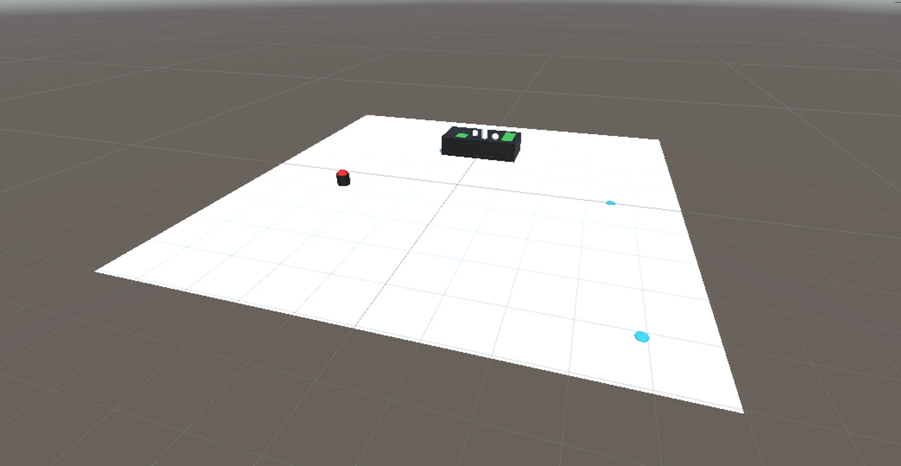

&copy; BOZANE Marius - VIALA Alexandre

# Features developed

All the content was mainly developed on our on. We only used the basic package from OpenXR to get the inputs of the Oculus controllers.

## Hand's animation

One started by animating the controllers and the hands

<table>
    <tr>
        <td>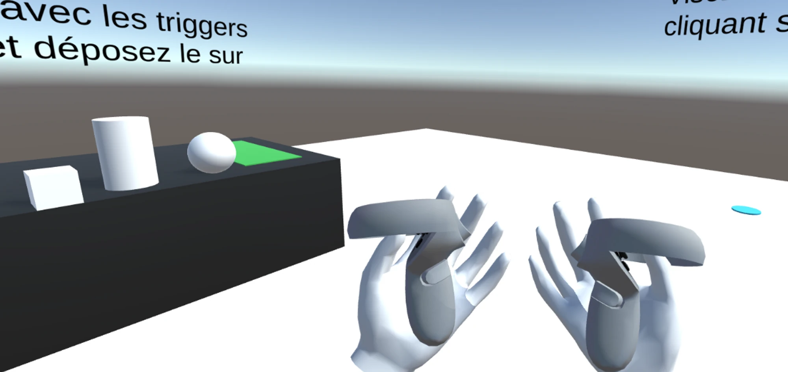</td>
        <td>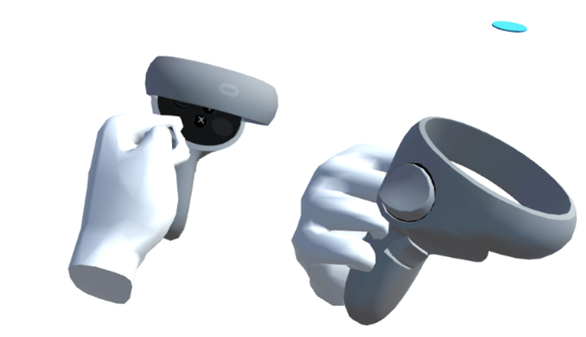</td>
        <td>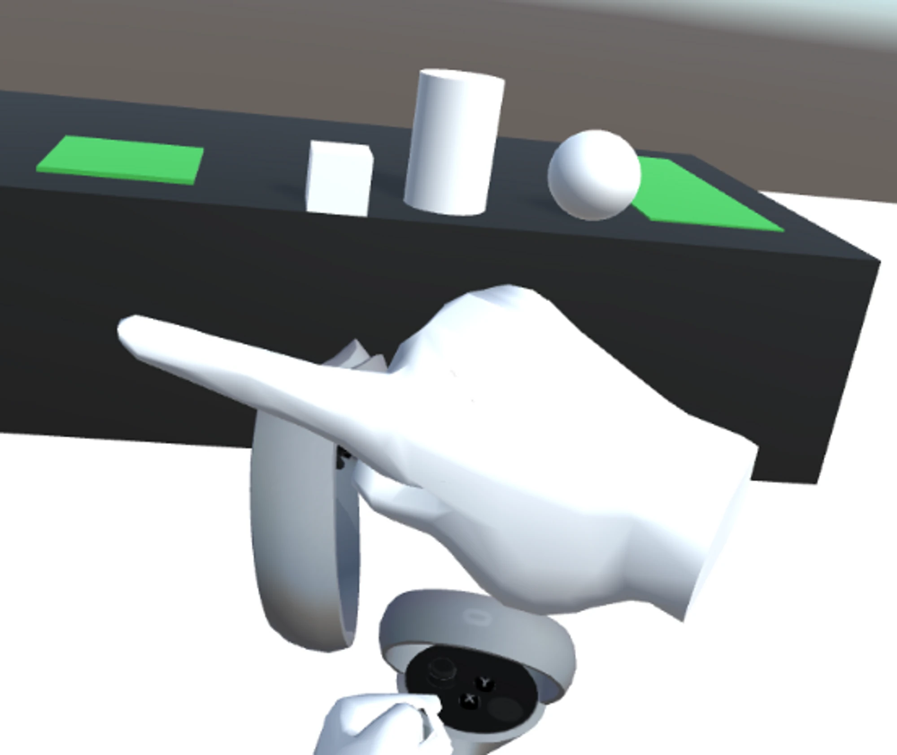</td>
    </tr>
</table>

<table>
    <tr>
        <td>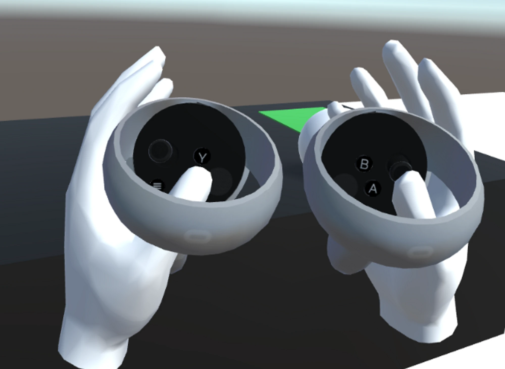</td>
    </tr>
</table>

## Interactions : Grab

<table>
    <tr>
        <td>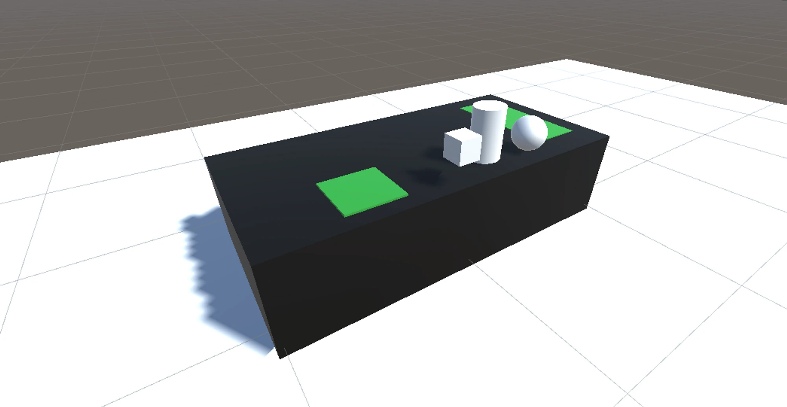</td>
    </tr>
</table>

You can grab objects and drop them on snap area.

<table>
    <tr>
        <td>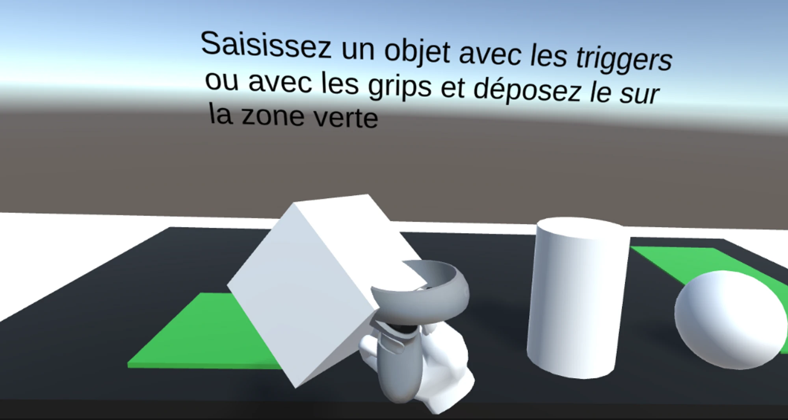</td>
        <td>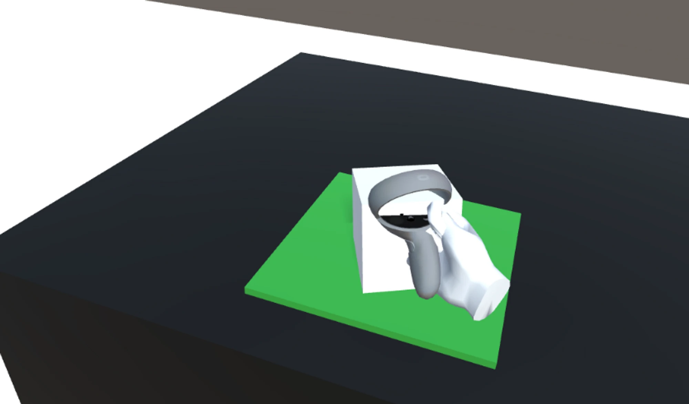</td>
        <td>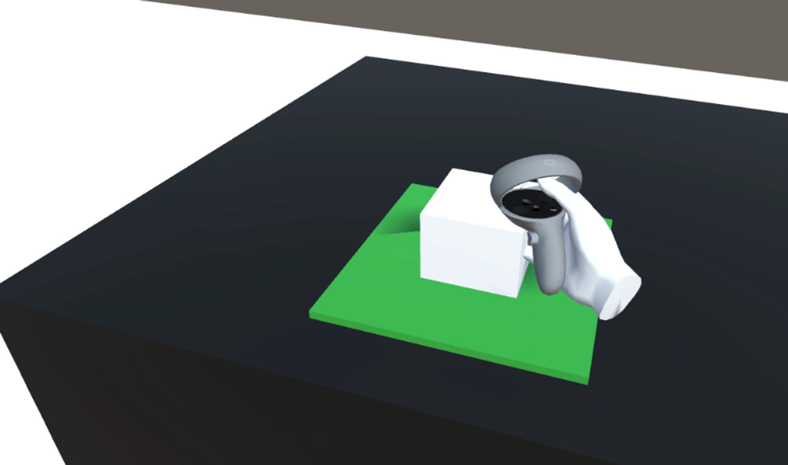</td>
    </tr>
</table>

## Interactions : Trigger

<table>
    <tr>
        <td>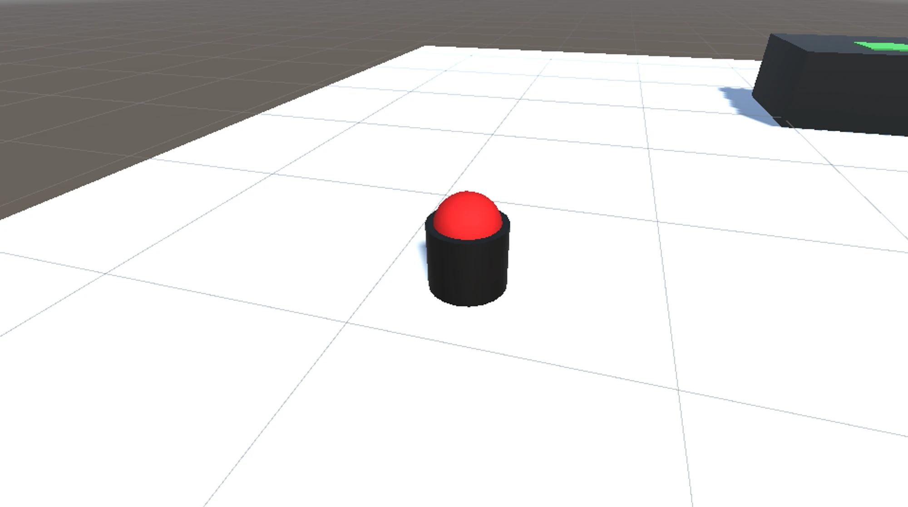</td>
    </tr>
</table>

You can trigger a button by touching it directly or by sending specific raycasts.

<table>
    <tr>
        <td>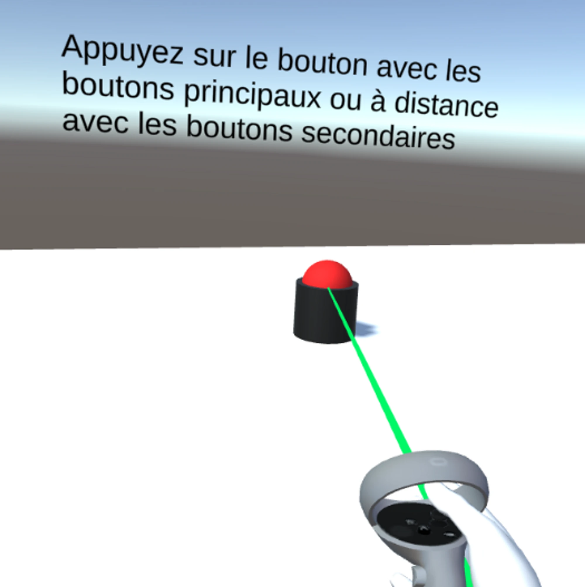</td>
        <td>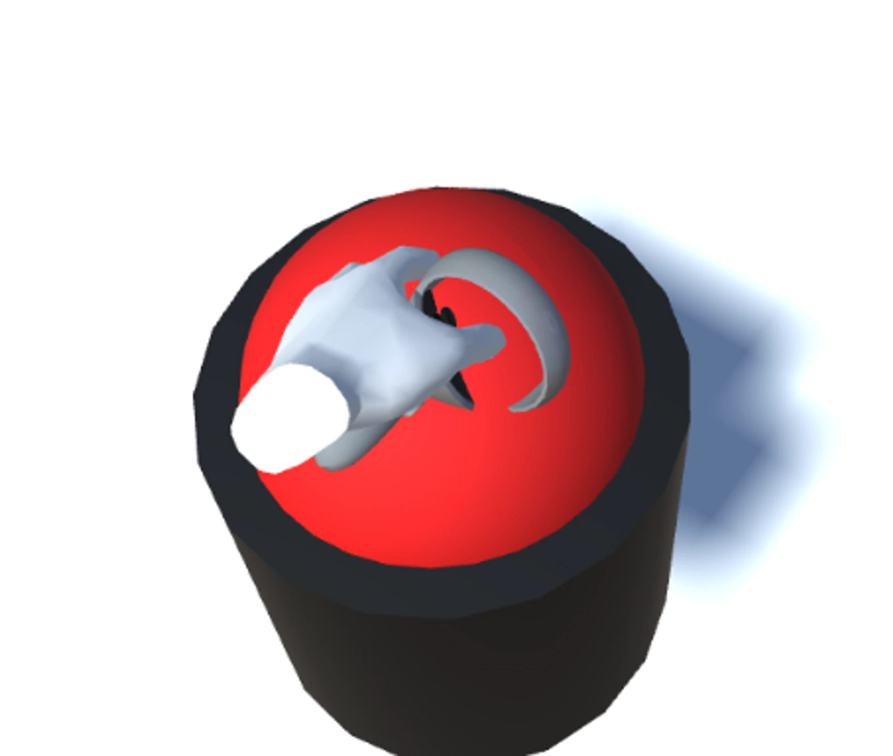</td>
        <td>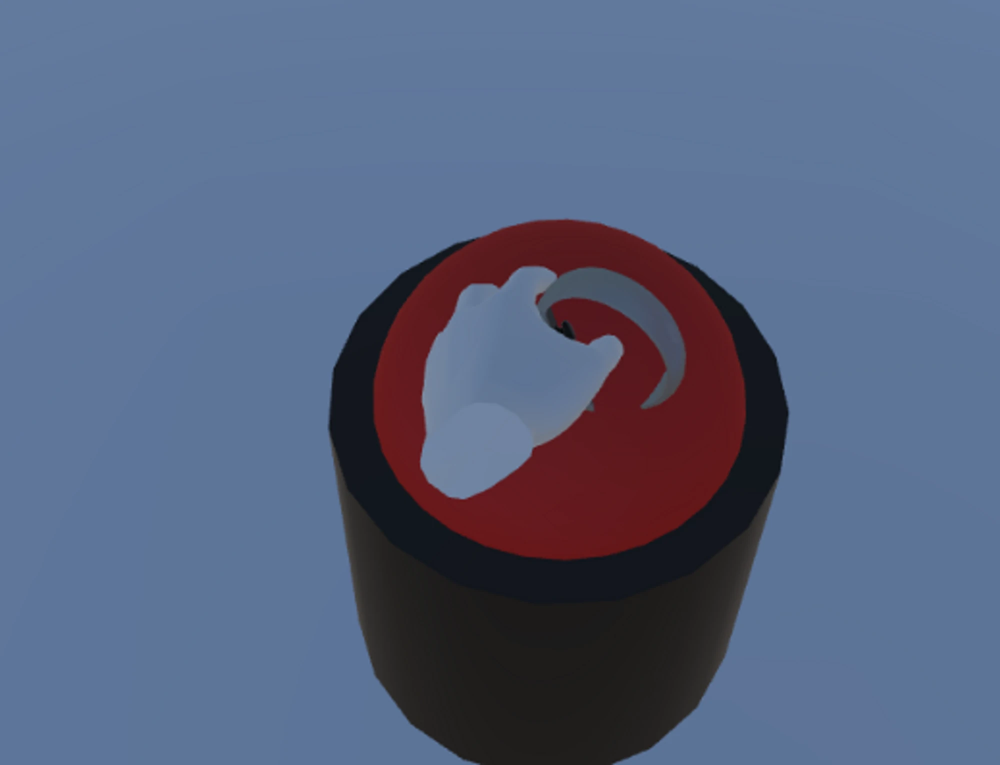</td>
    </tr>
</table>

## Interactions : Teleportation

<table>
    <tr>
        <td>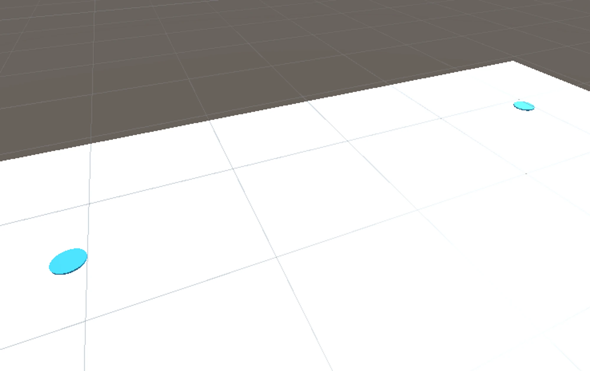</td>
    </tr>
</table>

Finally, you can teleport everywhere on the platform if it is allowed (i.e. only on the white space) by clicking on the pad button.

Alternatively, you can aim to a blue teleportation area to magnetize the raycast and have a more accurate aim for the teleportation.

<table>
    <tr>
        <td>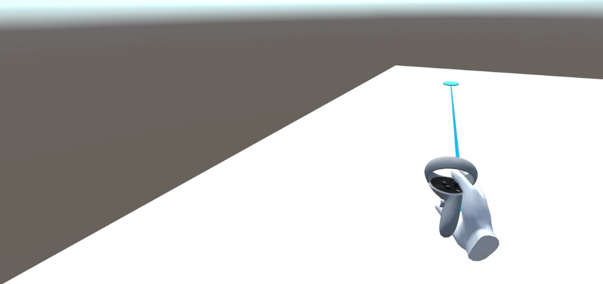</td>
    </tr>
</table>

# Video demonstration

    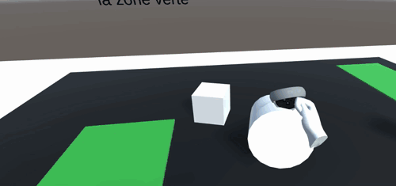

